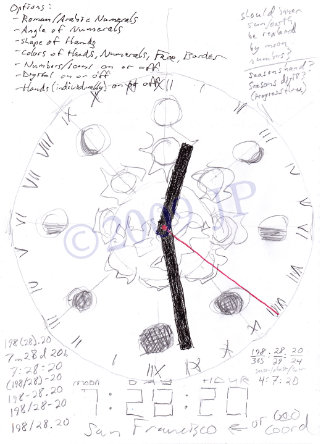

# Lunisolar Calendar Dial

*Combined display of seasonal points, lunar phases, and Gregorian months.*

This is a single-page, mobile-responsive, statically served website, for hosting a high-resolution image and a print-ready PDF.

Concept was first sketched in 2009:

 &#xa0; 

Print version was designed that same year: https://calendardial.net/

Motion version was developed in 2018: https://dateclock.net/
